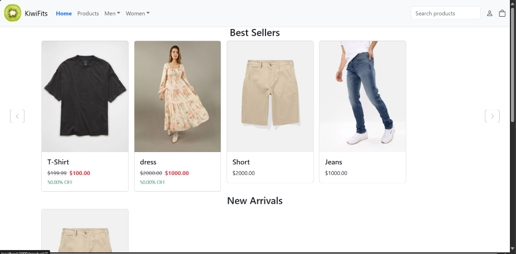
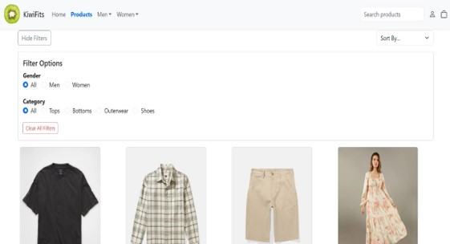
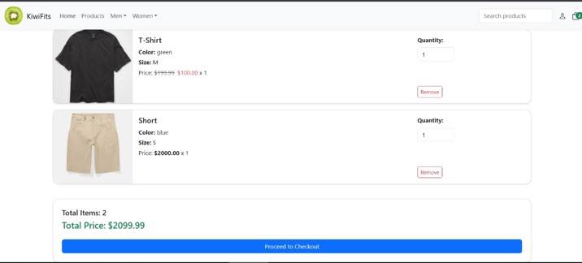
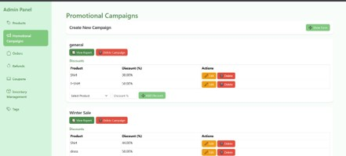

# PERN Ecommerce

Full-stack ecommerce application with a React frontend and an Express/PostgreSQL backend. The project includes customer shopping flows, profile management, promotions, and an admin panel for catalog and operations.

## Screenshots

|  |  |
| :---: | :---: |
| **Home Page** | **Products Listing** |
|  |  |
| **Shopping Cart** | **Admin Panel** |


## Features

### Customer Features
- Browse products and product tags
- View product details, variants, active discount data, and reviews
- Add/update/remove cart items (client-side cart context)
- Checkout flow with:
  - Saved shipping addresses
  - Cairo area shipping fees
  - Tax and total calculation
  - Coupon application
- Place orders and view order details/status
- Submit refund requests per order item
- Add or update product reviews
- View and delete own reviews
- Profile management:
  - Update username/email/phone
  - Upload profile image (Cloudinary)
  - View order history and refund history

### Admin Features
- Admin login
- Product management (create/update/delete with image upload)
- Product variant and inventory management
- Promotional campaign management
- Discount management by campaign/product
- Coupon CRUD and coupon usage reporting
- Orders listing, order details, and status updates
- Refund listing and refund status updates
- Tag management and tag-product assignments
- Top products and campaign reporting endpoints

## Tech Stack

### Frontend (client)
- React 19
- React Router DOM
- React Bootstrap + Bootstrap + Bootstrap Icons
- Context API for auth and cart state
- Fetch API (cookie-based auth requests with `credentials: include`)

### Backend (server)
- Node.js + Express 5
- PostgreSQL via `pg` connection pool
- JWT authentication in HTTP-only cookie
- `bcrypt` for customer password hashing
- `multer` for multipart uploads
- Cloudinary for image hosting
- Nodemailer + Handlebars templates for email flows (password reset)
- CORS, cookie-parser, morgan, dotenv

## Project Structure

```text
PERN Ecommerce/
  client/
    src/
      App.js                      # Main routes
      index.js                    # App bootstrap + AuthProvider
      contexts/
        authContext.js            # Auth state and /auth/check validation
        CartContext.jsx           # Cart state and actions
      components/
        ProtectedRoute.jsx        # User-only route guard
        AdminProtectedRoute.jsx   # Admin-only route guard
        Navbar.jsx
        ProductCard.jsx
        ...
      pages/
        Home.jsx
        ProductsPage.jsx
        ProductDetails.jsx
        Cart.jsx
        Checkout.jsx
        OrderDetails.jsx
        Profile.jsx
        Login.jsx
        Register.jsx
        ForgetPassword.jsx
        ResetPassword.jsx
        Admin.jsx
        AdminProducts.jsx
        AdminCampaigns.jsx
        AdminOrders.jsx
        AdminRefunds.jsx
        AdminInventory.jsx
        AdminCoupans.jsx
        AdminTags.jsx
        AdminLogin.jsx
      utils/
        auth.js

  server/
    app.js                        # Express app, middleware, route mounting
    config/
      db.js                       # PostgreSQL Pool (POSTGRES_URL)
      cloudinary.js               # Cloudinary config
    middlewares/
      auth.js                     # verifyToken + createToken (JWT cookie auth)
      mutler.js                   # Upload middleware
    routes/
      authRoutes.js
      userRoutes.js
      productRoutes.js
      orderRoutes.js
      promotionRoutes.js
      adminRoutes.js
    controllers/
      authController.js
      userController.js
      productController.js
      orderController.js
      promotionController.js
      adminController.js
    utils/Mailer/
      emails.js                   # SMTP transport + sendEmail
      template.js                 # Handlebars template renderer
      Templates/
        reset_password.hbs
        welcome.hbs
```

## Authentication Flows

Auth is implemented with JWT stored in an HTTP-only cookie named `token`.

### 1. Customer Registration
1. `POST /auth/register`
2. Validates required fields
3. Checks existing email in `client` table
4. Hashes password with bcrypt
5. Inserts customer row
6. Creates JWT and sets `token` cookie (`httpOnly`, `sameSite: Strict`, ~1 day)

### 2. Customer Login
1. `POST /auth/login`
2. Looks up user by email in `client`
3. Verifies password with bcrypt
4. Creates JWT with role `user`
5. Sets `token` cookie

### 3. Admin Login
1. `POST /auth/loginAdmin`
2. Looks up user by email in `admin`
3. Verifies credentials
4. Creates JWT with role `admin`
5. Sets `token` cookie

### 4. Session Validation
- Frontend `AuthProvider` calls `GET /auth/check` (with cookies).
- Backend verifies JWT via `verifyToken` middleware.
- Protected React routes (`ProtectedRoute`, `AdminProtectedRoute`) gate access based on auth state and role.

### 5. Logout
- `POST /auth/logout` clears `token` cookie.

### 6. Password Reset
1. `POST /auth/forget_password`
2. Generates reset token and saves it to `client.reset_token`
3. Sends reset email with link to frontend reset page
4. `POST /auth/resetPassword/:token` updates password and clears reset token

## Database Usage

### Engine and Access Pattern
- PostgreSQL is used as primary data store.
- Connection configured through `server/config/db.js` using `POSTGRES_URL`.
- Controllers issue SQL directly through `pool.query(...)`.

### Main Tables/Entities Referenced in Code
- `client`, `admin`
- `product_base`, `product_details`, `product_variant`
- `tags`, `product_tags`
- `product_reviews`
- `promotional_campaigns`, `discounts`
- `coupons`, `coupon_usage`
- `orders_base`, `orders_details`, `order_items`
- `refunds`

### Notable DB Modeling Patterns
- Composite/address-like structures are used for customer addresses and order statuses/details.
- Order status appears modeled as a structured/composite value with fields like stage, updated_at, and note.
- Address arrays are appended and expanded using PostgreSQL array/composite operations.

### Transactional Operations
- Order creation uses DB transactions:
  - Insert order base/details
  - Insert order items
  - Decrement inventory
  - Record coupon usage if applied
- Refund request creation also uses transactions and validates refundable quantities.

### Important Note
- `server/db.sql` is currently empty in this repository snapshot, so the schema above is inferred from SQL queries in controllers.

## Environment Variables

### Backend (`server/.env`)
- `POSTGRES_URL`
- `JWT_SECRET`
- `CLIENT_URL`
- `CLOUDINARY_CLOUD_NAME`
- `CLOUDINARY_API_KEY`
- `CLOUDINARY_API_SECRET`
- `SMTP_HOST`
- `SMTP_PORT`
- `SMTP_USER`
- `SMTP_PASS`

### Frontend (`client/.env`)
- `REACT_APP_API_URL`

## Local Setup

### 1. Install Dependencies

```bash
cd client
npm install

cd ../server
npm install
```

### 2. Configure Environment Files
- Create `.env` files in both `client` and `server` with the variables above.

### 3. Run the App

```bash
# backend
cd server
npm start

# frontend (new terminal)
cd client
npm start
```

Default backend port in code: `8000`.

## API Surface (High-Level)

- Auth: `/auth/*`
- Users/profile: `/users/*`
- Products/catalog/reviews: `/products/*`
- Orders/refunds: `/orders/*`
- Promotions/coupons: `/promotions/*`
- Admin operations: `/admin/*`

